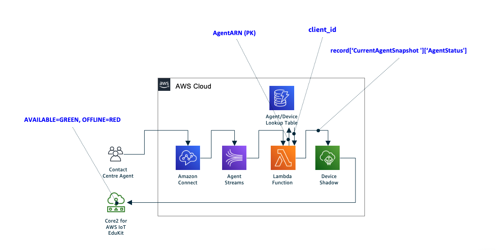

# Amazon Connect Agent Status
In this example, M5Stack Core2 for AWS IoT EduKit is configured to visually represent the status of an [Amazon Connect Contact Control Panel (CCP)](https://docs.aws.amazon.com/connect/latest/adminguide/agent-user-guide.html). The device connects to the [AWS IoT Device Shadow Service](https://docs.aws.amazon.com/iot/latest/developerguide/iot-device-shadows.html) and keeps the device in sync with the cloud while a small serverless application updates the device shadow document whenever the agent status changes.

Here is a high level diagram of how it works:

And here is a short demo of how the LEDs change color as soon as the agent changes their status:

This code is made to work exclusively with the M5Stack Core2 ESP32 IoT Development Kit for AWS IoT EduKit available on [Amazon.com](https://www.amazon.com/dp/B08VGRZYJR) or on the [M5Stack store](https://m5stack.com/products/m5stack-core2-esp32-iot-development-kit-for-aws-iot-edukit).

To find out more about the AWS IoT EduKit program, visit [https://aws.amazon.com/iot/edukit](https://aws.amazon.com/iot/edukit).