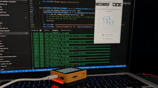

# Amazon Connect Agent Status
In this example, the [M5Stack Core2 for AWS IoT EduKit](https://aws.amazon.com/iot/edukit/#Get_started_with_AWS_IoT_EduKit) visually represents the status of an [Amazon Connect Contact Control Panel (CCP)](https://docs.aws.amazon.com/connect/latest/adminguide/agent-user-guide.html). The device connects to the [AWS IoT Device Shadow Service](https://docs.aws.amazon.com/iot/latest/developerguide/iot-device-shadows.html) and keeps the device in sync with the cloud while a small serverless application updates the device shadow document whenever the agent status changes.

When the CCP status is set to Available, the LED bars on the sides will change to green to visually represent them being available and red to show they're offline. This simple example can be expanded to utilize the display using the LVGL library and other hardware features documented in the device's [API reference](https://edukit.workshop.aws/en/api-reference/index.html). Some notable examples could be to display additional agent info on the screen, or setup for WiFi and other settings.

## Architecture
Here is a high level diagram of how it works and the services used:


## Demo
A short gif of how the LEDs change color after the agent changes their status:



## Getting Started
### Pre-requisites
In order to execute this example, you'll need to have your environment setup. The best way have the necessary tools to compile and install the device firmware, AWS CLI configuration setup, validate your setup, and get familiar with key concepts is to complete the two tutorials in the official AWS IoT EduKit content first, and then install the AWS Cloud Development Kit (CDK):

1) [Getting Started tutorial](https://edukit.workshop.aws/en/getting-started.html)
2) [Cloud Connected Blinky tutorial](https://edukit.workshop.aws/en/blinky-hello-world.html)
3) [Installing the AWS CDK](https://docs.aws.amazon.com/cdk/latest/guide/getting_started.html#getting_started_install)

### Configure WiFi
Next, clone this repository, open the Amazon_Connect-Agent_Status folder in Visual Studio Code, open the [PlatformIO CLI terminal window](https://edukit.workshop.aws/en/blinky-hello-world/prerequisites.html#open-the-platformio-cli-terminal-window), and enter the following command to connect to your WiFi network:

```bash
pio run -e core2foraws -t menuconfig
```

Go to **AWS IoT EduKit Configuration** to then enter your SSID and password. Note that your network must be a 2.4GHz network.

### Create and deploy the AWS CloudFormation template
In order to synthesize the CloudFormation template and deploy it to your AWS account, you'll need to first install all the necessary dependencies. First, go to the `Agent_Status-Cloud_App` directory and then use pip to install the Python 3.x dependencies:
```bash
cd Agent_Status-Cloud_App
pip -r requirements.txt
```

Lastly you'll synthesize your CloudFormation template from the scripts and deploy the stack to your AWS account in the region specified in your AWS CLI configuration.
```bash
cdk synth
cdk deploy
```

### Testing the application
With the cloud services running and configured, you can upload the firmware to your device and test this application. Use the following command to compile and upload to the device. The additional `-t monitor` parameter and option lets you view the serial output on your local machine from the connected device:
```bash
pio run -e core2foraws -t upload -t monitor
```

The application should now be running successfully on the device and the device should be connected to AWS IoT and subscribed to it's own [device shadow](https://docs.aws.amazon.com/iot/latest/developerguide/iot-device-shadows.html) for changes.

Toggling the agent status in Amazon Connect should toggle the LED lights on the sides of the device.

## Cleanup
To save power, resources, and avoid any accidental AWS charges, we recommend that after you are done, to delete your CloudFormation stack and turn off or wipe the device. Follow the official doc to [deleting the CloudFormation stack](https://docs.aws.amazon.com/AWSCloudFormation/latest/UserGuide/cfn-console-delete-stack.html).

Turn off the power on the device by holding the power button for 6 seconds or more to turn it off. Additionally, you can erase the flash memory to wipe out the application by running the following command from the PlatformIO CLI terminal window:
```bash
pio run -e core2foraws -t erase
```

Upon resetting the device after it's been wiped, it will emit a ticking sound from the speaker as the device reboots repeatedly. It's perfectly normal. The sound occurs from the power chip supplying power to the speaker amplifier and the MCU causing a reboot since there is no application to run. Uploading any firmware will stop the constant reboots.

Notes:
This code is made to work exclusively with the M5Stack Core2 ESP32 IoT Development Kit for AWS IoT EduKit available on [Amazon.com](https://www.amazon.com/dp/B08VGRZYJR) or on the [M5Stack store](https://m5stack.com/products/m5stack-core2-esp32-iot-development-kit-for-aws-iot-edukit).

To find out more about the AWS IoT EduKit program, visit [https://aws.amazon.com/iot/edukit](https://aws.amazon.com/iot/edukit).