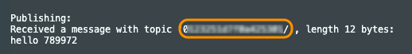
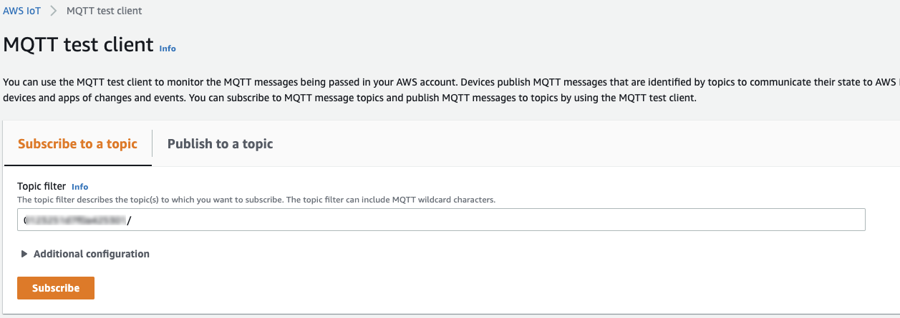

# Basic AWS IoT Connectivity Arduino Example for the M5Stack Core2 for AWS IoT EduKit

This is a basic AWS IoT connectivity example using the Arduino-style framework for Espressif MCU hardware on PlatformIO with the M5Stack Core2 ESP32 IoT Development Kit for AWS IoT EduKit (available on [Amazon.com](https://www.amazon.com/dp/B08VGRZYJR) or on the [M5Stack store](https://m5stack.com/products/m5stack-core2-esp32-iot-development-kit-for-aws-iot-edukit)). This example takes advantage of the on-board Microchip ATECC608 Trust&GO secure element that is pre-provisioned with a private key that can be used for connectivity to AWS IoT.

The AWS IoT EduKit program makes it easy to learn how to build end-to-end IoT applications using secure hardware, content, and code examples.

The example provided connects to your Wi-Fi network, connects to AWS IoT Core, and publishes a simple message on the topic _<<DEVICE_SERIAL_NUMBER>>/_. With the device serial number being the unique serial number of the device, and also the MQTT client Id.

## How to use this example
To use this example, you will need to complete the [Getting Started](https://edukit.workshop.aws/en/getting-started.html) and [Cloud Connected Blinky](https://edukit.workshop.aws/en/blinky-hello-world.html) tutorials first.

1) Open a new VSCode window and clone/open this repository. Navigate to the **Basic_Arduino/include/arduino_secrets.h** file and enter your Wi-Fi credentials in between the quotes, replacing the default values. Make sure to put the SSID to a 2.4GHz network. 5GHz is not supported by the hardware.

2) Open the [PlatformIO CLI terminal window](https://edukit.workshop.aws/en/blinky-hello-world/prerequisites.html#open-the-platformio-cli-terminal-window) and retrieve your AWS IoT endpoint address with the AWS CLI using the code below. Copy and paste it into the **Basic_Arduino/include/arduino_secrets.h** file to define the **AWS_IOT_ENDPOINT_ADDRESS**.
    
    ```bash
    aws iot describe-endpoint --endpoint-type iot:Data-ATS
    ```

3) Open the file **Blinky-Hello-World/utilities/AWS_IoT_registration_helper/output_files/device_cert.pem** file. This file was created when you completed the Cloud Connected Blinky tutorial. Copy and paste the contents into the **Basic_Arduino/include/arduino_secrets.h** file to define the **THING_CERTIFICATE**.
   
4) From within your PlatformIO CLI terminal window, change into the **Basic_Arduino** directory and then compile the device firmware, upload to the device, and monitor the serial output with the following commands:
```bash
cd Basic_Arduino
pio run -e core2foraws -t upload -t monitor
```

6) After successful connection, the device will start publishing data to AWS IoT. You will see output in the serial monitor running in the PlatformIO CLI terminal window. Copy the topic from within the single quotes in the terminal window (e.g. 012345abcdefg/).



7) Visit the [AWS IoT MQTT test client](https://us-west-2.console.aws.amazon.com/iot/home?region=us-west-2#/test) and paste that topic in to the topic filter textbox in the MQTT test client. Click the **Subscribe** button and you should see the same messages in the AWS IoT MQTT test console.



## Cleanup
To save power and avoid any accidental AWS charges, we recommend that after you are done, you turn off the power on the device by holding the power button for 6 seconds or more to turn it off. Additionally, you can erase the flash memory to wipe out the application by running the following command from the PlatformIO CLI terminal window:
```bash
pio run -e core2foraws -t erase
```

Upon resetting the device after it's been wiped, it will emit a ticking sound from the speaker as the device reboots repeatedly. It's perfectly normal. The sound occurs from the power chip supplying power to the speaker amplifier and the MCU causing a reboot since there is no application to run. Uploading any firmware will stop the constant reboots.

## Hardware API example
For examples of how to use the hardware features without any connectivity, take a look at the repository from M5Stack: https://github.com/m5stack/M5Core2/tree/master/examples/core2_for_aws/FactoryTest

## Third Party Library License Notice
This software depends on ArduinoECCX08 and ArduinoMqttClient under LGPL-2.1. Note that these are copy-left licenses. The libraries are not distributed within this software repository, they are imported in by the PlatformIO library manager.